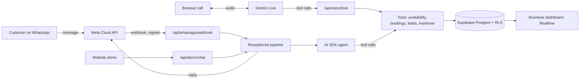

# Callora

**An AI receptionist for WhatsApp and phone calls.** Callora answers the customers of salons, spas, clinics and other appointment-based businesses in Arabic and English (and Turkish), books real appointments from a live calendar, and hands tricky conversations to the team.

Multi-tenant SaaS: every business connects its own WhatsApp Business number, and each business's data is isolated at the database level.

> Live demo: _link coming with the next deployment_

## What it does

- **Answers on WhatsApp** through Meta's official WhatsApp Business Platform (Cloud API). One platform webhook, routed to the right business by the receiving number.
- **Answers calls (beta).** The same assistant speaks through Gemini Live with the same instructions, tools and booking rules. The browser receives a short-lived token whose setup is locked on the server; tool calls run server-side and every call is saved as a transcript.
- **Never invents facts.** The assistant can only answer from backend tools: business info, services and prices, availability, bookings, leads and human handover.
- **Books for real.** Availability is computed from opening hours, split shifts, staff schedules, buffers and notice rules. A booking is confirmed only after the database accepts it; a Postgres exclusion constraint makes double bookings impossible.
- **Hands over to humans.** Complaints and anything uncertain are flagged, auto-replies stop, and staff take over the chat.
- **Speaks like the customer.** Levantine and Gulf Arabic, Arabizi, English and Turkish, in the tone the business chooses.
- **Website demo** that runs the exact same pipeline as WhatsApp.

## Architecture



- **Tenant isolation.** Every tenant-owned row carries `business_id`. Row-level security limits users to their own businesses, and composite foreign keys `(business_id, id)` make cross-tenant references impossible even for server code.
- **Tool context.** Tools receive `businessId`, `conversationId` and `customerId` through AI SDK tool context, which the model never sees, so it cannot point a tool at another business or customer.
- **Idempotent webhooks.** WhatsApp message ids are unique per business, so Meta's retries never create duplicate replies.

## Tech stack

| Layer | Choice |
| --- | --- |
| App | Next.js 16 (App Router), React 19, TypeScript |
| UI | Tailwind CSS v4, shadcn/ui (Base UI), Motion, Phosphor icons |
| i18n | next-intl: English, Arabic (RTL), Turkish |
| Data | Supabase: Postgres, Auth, Row-Level Security, Realtime |
| AI | Vercel AI SDK 7 with tool calling; Gemini or OpenAI via one env var |
| Messaging | WhatsApp Business Platform (Cloud API) |
| Tests | Vitest; PGlite (in-memory Postgres) for database and RLS tests |
| Hosting | Vercel |

## Getting started

```bash
npm install
cp .env.example .env.local        # fill in Supabase, AI and WhatsApp values
npm run db:push                   # apply supabase/migrations to your project
npm run db:seed                   # demo businesses + demo login
npm run dev                       # http://localhost:3000
```

## Scripts

| Script | Purpose |
| --- | --- |
| `npm run dev` / `build` / `start` | Next.js |
| `npm test` | Unit and database tests (no Docker or network needed) |
| `npm run typecheck` / `lint` | TypeScript and ESLint |
| `npm run db:push` | Apply SQL migrations to Supabase |
| `npm run db:types` | Regenerate `database.types.ts` from the migrations |
| `npm run db:seed` | Seed demo tenants |
| `npm run whatsapp:connect -- <slug> <phone-number-id> <waba-id> <token>` | Connect a WhatsApp number to a business |

## Tests

`npm test` runs:

- **Tenant isolation:** another business's rows can't be read, inserted, updated, moved or deleted; anonymous visitors see nothing; WhatsApp tokens are unreadable to members.
- **Roles:** viewers read only, staff handle appointments but not configuration, only platform admins change plans and status.
- **Double-booking guard:** overlaps are rejected, buffers respected, cancelled slots freed.
- **Availability engine:** time zones (Amman, Dubai, Istanbul), split shifts, personal schedules, minimum notice and booking window.

## Project structure

```
supabase/migrations/     SQL schema, RLS policies, functions
supabase/tests/          PGlite-based database tests
src/lib/booking/         availability engine (pure, tested)
src/lib/receptionist/    agent, tools, instructions, message pipeline
src/lib/channels/        WhatsApp Cloud API client and delivery
src/app/api/             webhook and demo endpoints
src/app/[locale]/        localized pages
src/components/          UI (landing, demo phone, shadcn/ui)
messages/                en / ar / tr copy
scripts/                 seed and type generation
```

## Roadmap

- Business dashboard: inbox with human takeover, appointments, services, staff, hours, FAQs, analytics
- Platform admin: businesses, plans, usage
- WhatsApp Embedded Signup so businesses connect their number themselves
